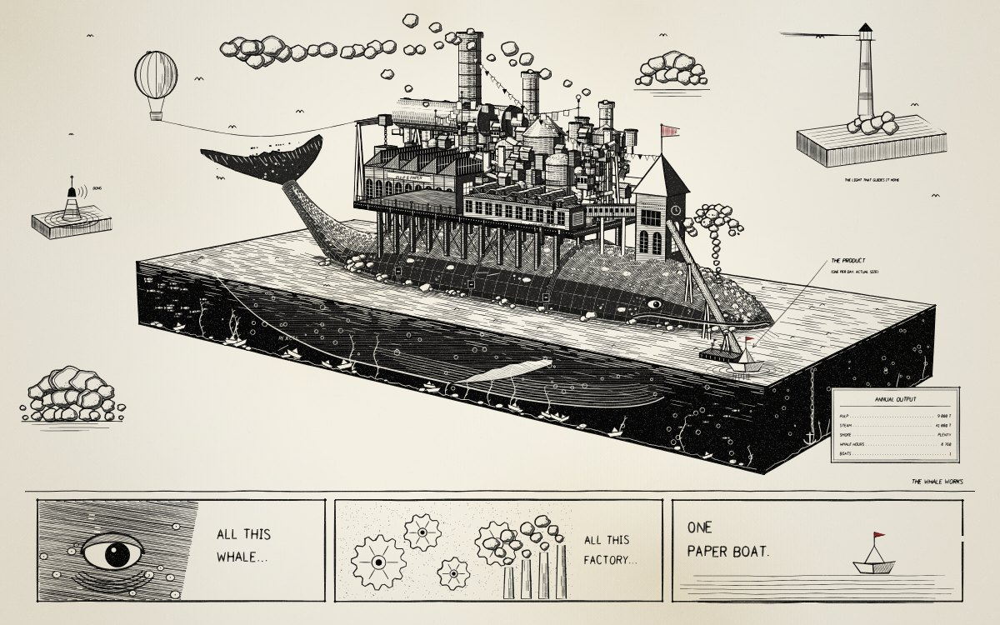
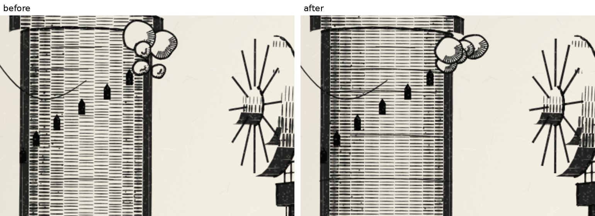
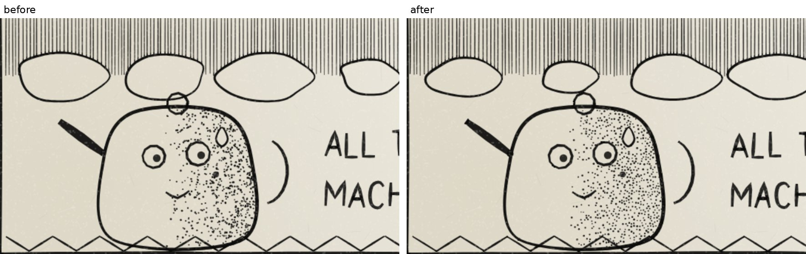
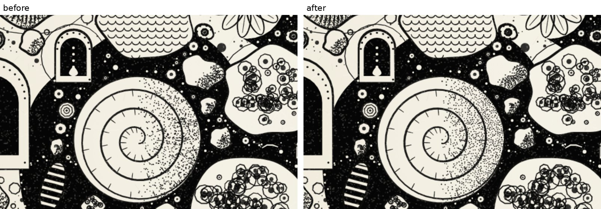
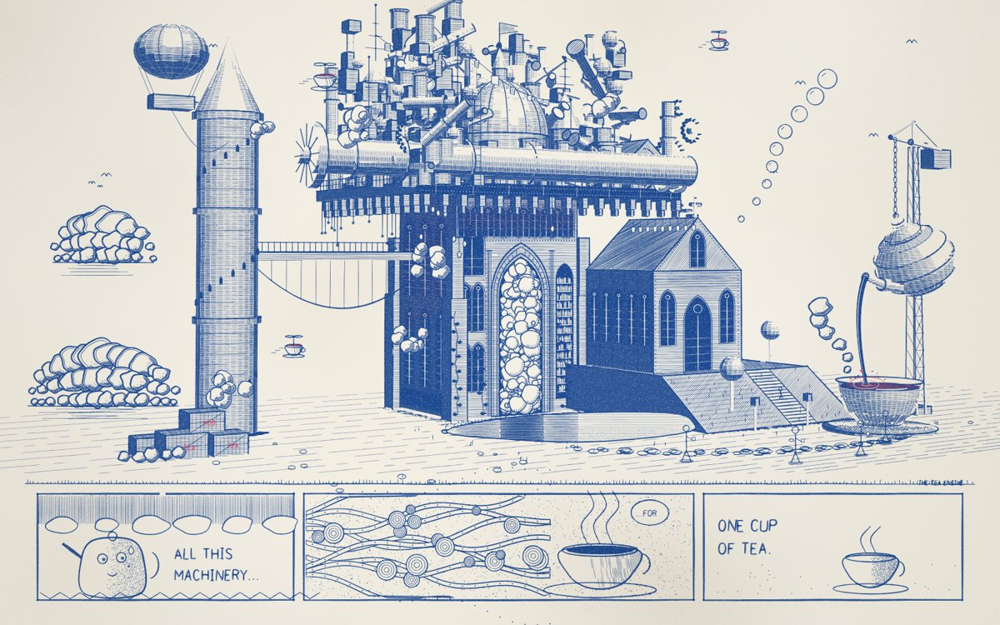
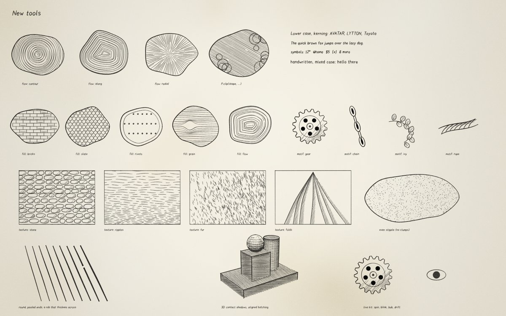

<p align="center"></p>

<h1 align="center">Doodle with Agents</h1>

**Hand-drawn sketches and doodles, drawn stroke by stroke in plain JavaScript. Give this repo to your coding agent
and ask it for a drawing.**


Every line here is code: a pencil stroke with wobble, pressure and overshoot; hatching clipped to a shape;
stipple, watercolour washes, handwriting, cloud ropes, engraved bark, a 3D camera whose shading is done with a pen.
The viewer replays the strokes with a pencil, so each drawing is drawn in front of you. No build step, no
libraries, no images.

## Make a drawing with your agent

Clone the repo, open your coding agent (Claude Code, Codex, Cursor, …) in it, and ask:

> Draw a lighthouse on a rock in a stormy sea, in ink on kraft paper, with a cutaway of the lamp room.

> Make a dense black-and-white ink doodle of an octopus whose tentacles turn into a little city.

> Draw an exploded technical drawing of a vintage typewriter on graph paper, with labelled parts.

The agent reads [`AGENTS.md`](AGENTS.md), which teaches it the API, the paper styles and the rules that make a
drawing look hand-made. It then writes `scenes/<name>.js` and renders it to see what it drew, fixing the drawing
until it is right. Claude Code also gets the `doodle` skill in `.claude/skills/`.

The last three plates were made exactly this way: three fresh agents, each given only this repo and one of the
prompts above, working for 7 to 14 minutes. The typewriter was drawn by a smaller, cheaper model.

| *Lighthouse* | *Octopolis* | *Typewriter (exploded)* |
|---|---|---|
|  |  |  |

Setup:

```sh
npm install
npx playwright install chromium      # the agent renders with this to see its drawing
```

## Ask for a style

The richest style here has a name you can ask for: **dense ink**. It is the look of *Tea Engine*, *Clock Island*
and *The Whale Works*: every surface is inked, there are big black shapes and white puffs, and one ridiculous idea
fills the whole page. Add **"in dense ink"** to your prompt:

> Draw a giant snail carrying a whole Victorian town on its shell, in dense ink.

> In dense ink: a whale that has a whole factory built on its back, and all the factory makes is one paper boat.

> A dense ink drawing of a library floating on a jellyfish, with the books leaking out of the bottom.



*The Whale Works* was drawn by a fresh agent in 21 minutes from the second prompt above.

For this style the agent follows the *dense ink* recipe in `AGENTS.md`. It builds the masses in 3D, inks
detail onto every face, piles up machinery and fills the page with small things around the main subject. The best
prompts give it **one weird idea and one joke**. These drawings take longer, 20 to 30 minutes.

You can also name any plate and the agent works in its style: *Lighthouse* (ink on kraft with white highlights), *Typewriter* or *Camera*
(exploded technical drawing), *Cathedral* (sepia section with wash), *Library Tree* (white lines on cyanotype
blue), *Bridge* (ballpoint), *Space Elevator* (graph-paper diary), *Ink Garden* (grown black-and-white doodle).

## What's new: a better pen

The engine has been sharpened so every drawing looks more hand-made, and it can do a few new things. The before and
after images are 3× close-ups of the same drawings, same layout, drawn with the old and the new engine.

**Hatching that meets.** 3D faces hatch on a shared grid, so the lines on neighbouring faces of a curved surface run
on as one stroke instead of breaking at every edge.



**Stipple without clumps.** Dots keep a little apart, the way a stippler places them, and the gradient stays.



**Pen strokes with round, inked ends.** Every stroke now starts and ends in a slightly darker round blob, where the
ink pools as the pen lands and lifts, and the nib is a touch wider across than along. Long lines skip now and then,
like a drying pen.



**Riso printing.** Render any drawing in two inks, slightly out of register: `node tools/render.mjs junkcathedral
--theme riso`.



**New tools**, all in [`AGENTS.md`](AGENTS.md) (`node tools/render.mjs _features` draws this sheet):



* `P.flow(shape, { field })`: hatching that follows the form (rings, along the edge, radial or any direction field).
* `P.clip(shape, () => { … })`: anything drawn inside is clipped to a shape.
* Lettering in lower case (`{ case: 'mixed' }`), with kerning and more symbols (º @ $ [ ]).
* Fills `bricks`, `slate`, `rivets`, `grain`, `flow`; motifs `gear`, `chain`, `ivy`, `rope`.
* Textures `SketchKit.tex.stone / ripples / fur / folds`.
* Contact shadows in 3D (`D.render(…, { contactShadow: 6 })`): parts darken the parts behind them.
* `P.live(fn)` and `SketchKit.liveKit.spin / bob / blink / drift` for moving parts in the pen videos.
* `P.isolate(tag, fn)`: a part with its own randomness, so editing it does not reshuffle the rest of the drawing.
* Style presets in `Sketch.STYLES` (`dense-ink`, `technical`, `ballpoint`, `kraft`, `riso`).
* `node tools/export-svg.mjs <scene> [--plotter]`: an SVG of the drawing, or strokes only for a pen plotter.
* `node tools/critique.mjs renders/<name>.png`: a squint test that flags empty quarters, too much grey, no blacks or
  no focal point.

## Look at the drawings

Open `index.html` in a browser (or `npm run serve`). It is a spiral sketchbook: flip through the plates and press
**D** to watch one drawn from a blank page. You can change the speed (1–5), pause (P) or finish the drawing
(Space). `sheet.html?scene=house` opens a single drawing.

```sh
node tools/render.mjs house                    # renders/house.png
node tools/render.mjs house --stages 4         # the drawing at four stages of the pen
node tools/render.mjs house --width 4800 --crop 600,100,1000,350   # a 3x close-up of one box
node tools/render.mjs house --video            # renders/house.mp4, the pen drawing it (needs ffmpeg)
node tools/render.mjs house --theme riso       # the same drawing as a two-ink riso print
node tools/export-svg.mjs house                # renders/house.svg (--plotter: strokes only)
node tools/critique.mjs renders/house.png      # what looks wrong from across the room
node tools/gallery.mjs                         # every plate → docs/images/
```

## What is in it

| | |
|---|---|
| `src/engine.js` | The 2D engine. Lines, curves, ellipses, hatching and cross-hatching, stipple and washes. Also a built-in single-stroke alphabet, notes with leader lines, dimension lines, cumulus clouds, cloud ropes, leaves, engraved strands and circuit traces. |
| `src/engine3d.js` | A perspective camera with solids (extrusions, cylinders, gears, lathe shapes). Hidden faces are removed, and each face is shaded by pen hatching that follows the light, in a dozen styles (engraving, stipple, contour, spot black, wash and more). |
| `src/doodle.js` | The doodle kit. 20 motifs and 12 pattern fills, growth by packing or by budding, tendrils, tentacles and spires, and the shading moves that make black-and-white ink read as volume. |
| `src/kit.js` | A toolbox of noise, colour, Voronoi and jigsaw cells, Poisson packing, contour lines and watercolour with blooms and granulation. |
| `scenes/` | 24 drawings to learn from, plus two starter templates. |

The plates: *Spaceship · Burj Khalifa · Bridge · Space Elevator · Mechanical Robot · Pyramids · Library Tree ·
Cathedral · Watch Movement (plan and 3D) · Nave · Camera (exploded) · Rotunda · Doodle · Automatic Doodle · Ink
Garden · Tea Engine · Clock Island · The House That Draws Itself · Doodle Kit · Lighthouse · Octopolis ·
Typewriter · The Whale Works*.

## Publishing the sketchbook

It is a static site. GitHub Pages, Vercel or any file host can serve the repo root as it is.

## Icon

`docs/icon/` has the icon (1024, 512, 256, rounded and square), a favicon and `social-card.png`. Upload the card in
the repo's Settings → Social preview. The icon was drawn with the engine itself: `docs/icon/icon-scene.js`.

## Licence

MIT — see [LICENSE](LICENSE). Drawings you make with it are yours.
