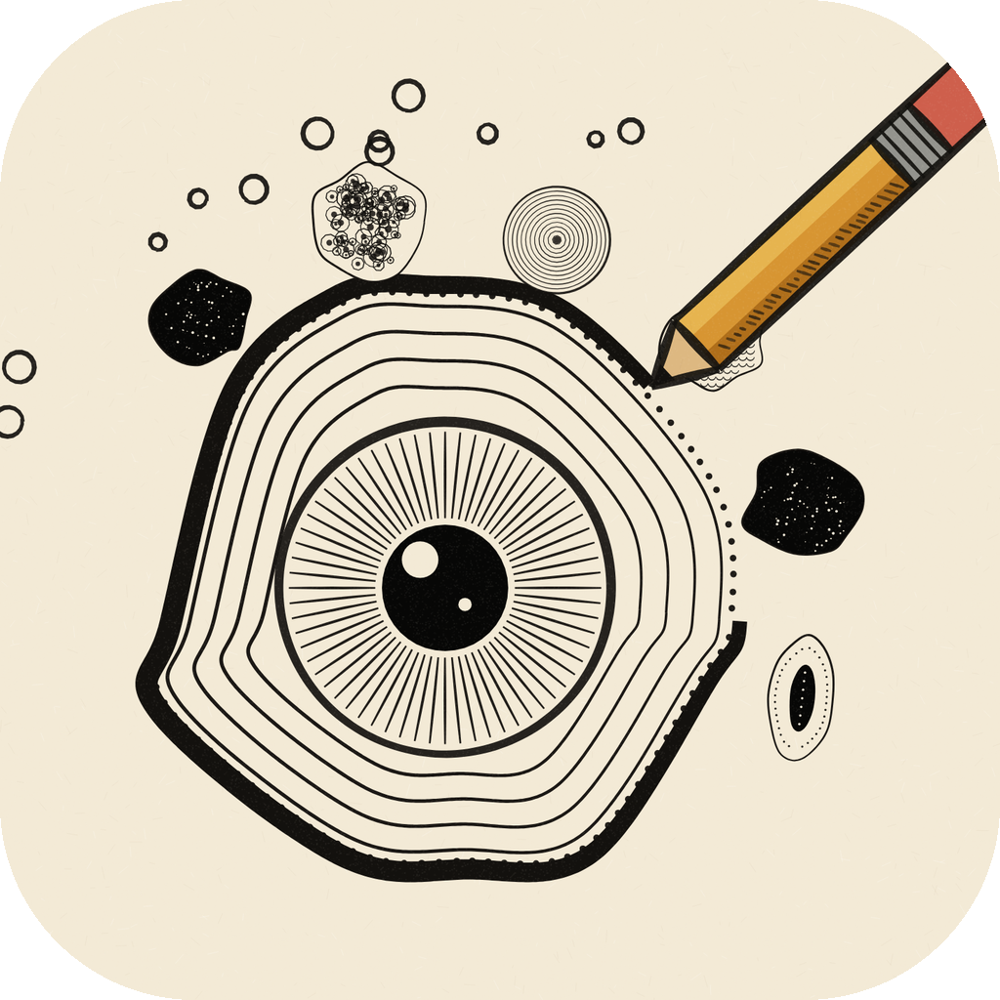
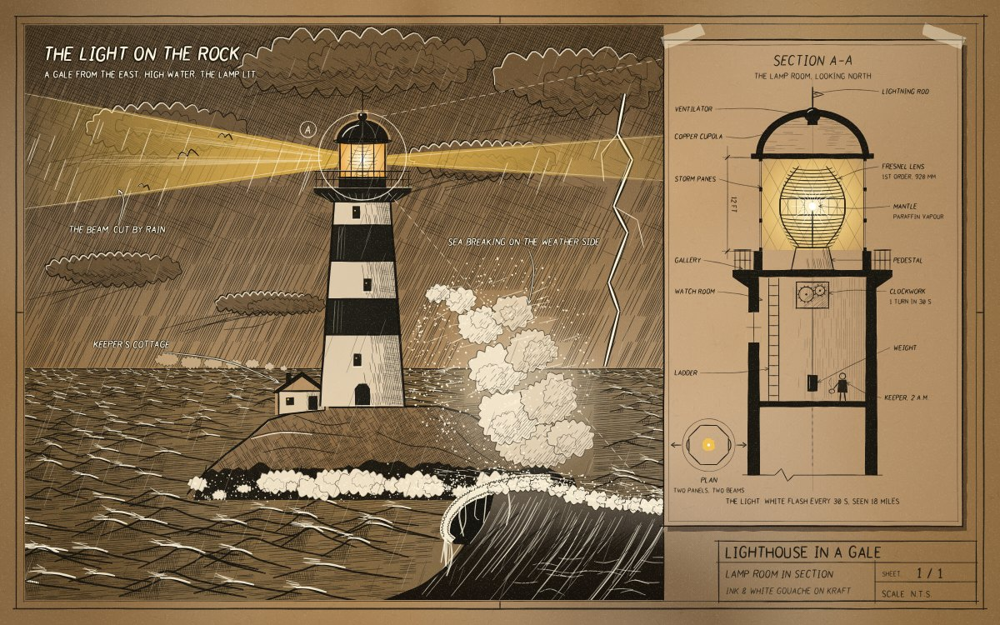
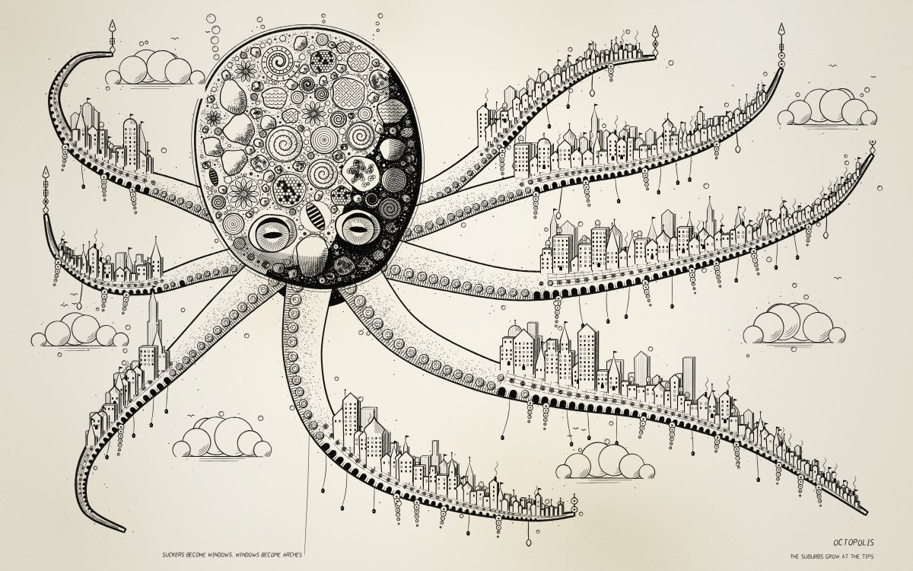
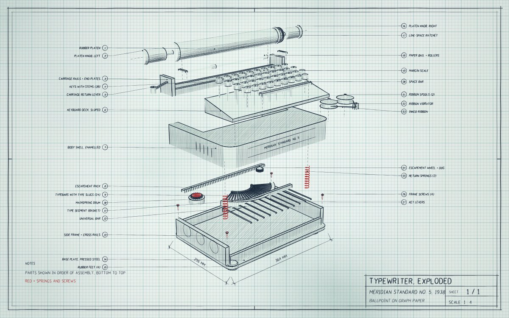

<p align="center"></p>

<h1 align="center">Doodle with Agents</h1>

**Hand-drawn sketches and doodles, drawn stroke by stroke in plain JavaScript. Give this repo to your coding agent
and ask it for a drawing.**


Every line here is code: a pencil stroke with wobble, pressure and overshoot; hatching clipped to a shape;
stipple, watercolour washes, handwriting, cloud ropes, engraved bark, a 3D camera whose shading is done with a pen.
The viewer replays the strokes with a pencil, so each drawing is drawn in front of you. No build step, no
libraries, no images.

## Make a drawing with your agent

Clone the repo, open your coding agent (Claude Code, Codex, Cursor, …) in it, and ask:

> Draw a lighthouse on a rock in a stormy sea, in ink on kraft paper, with a cutaway of the lamp room.

> Make a dense black-and-white ink doodle of an octopus whose tentacles turn into a little city.

> Draw an exploded technical drawing of a vintage typewriter on graph paper, with labelled parts.

The agent reads [`AGENTS.md`](AGENTS.md), which teaches it the API, the paper styles and the rules that make a
drawing look hand-made. It then writes `scenes/<name>.js` and renders it to see what it drew, fixing the drawing
until it is right. Claude Code also gets the `doodle` skill in `.claude/skills/`.

The last three plates were made exactly this way: three fresh agents, each given only this repo and one of the
prompts above, working for 7 to 14 minutes. The typewriter was drawn by a smaller, cheaper model.

| *Lighthouse* | *Octopolis* | *Typewriter (exploded)* |
|---|---|---|
|  |  |  |

Setup:

```sh
npm install
npx playwright install chromium      # the agent renders with this to see its drawing
```

## Ask for a style

Name a plate and the agent works in that plate's style. The richest is the dense, slightly mad ink
style of *Tea Engine* and *Clock Island*. Every surface is inked, there are big black shapes and white puffs, and
one ridiculous idea fills the whole page:

> Draw a giant snail carrying a whole Victorian town on its shell, in the Tea Engine style.

> In the Tea Engine style: a lighthouse that has grown a factory on top, and all it makes is one paper boat.

> A Clock Island style drawing of a library floating on a jellyfish, with the books leaking out of the bottom.

For this style the agent follows the *dense ink style* recipe in `AGENTS.md`. It builds the masses in 3D, inks
detail onto every face, piles up machinery and fills the page with small things around the main subject. The best
prompts give it **one weird idea and one joke**. These drawings take longer, often 20 to 40 minutes.

Other styles to ask for by name: *Lighthouse* (ink on kraft with white highlights), *Typewriter* or *Camera*
(exploded technical drawing), *Cathedral* (sepia section with wash), *Library Tree* (white lines on cyanotype
blue), *Bridge* (ballpoint), *Space Elevator* (graph-paper diary), *Ink Garden* (grown black-and-white doodle).

## Look at the drawings

Open `index.html` in a browser (or `npm run serve`). It is a spiral sketchbook: flip through the plates and press
**D** to watch one drawn from a blank page. You can change the speed (1–5), pause (P) or finish the drawing
(Space). `sheet.html?scene=house` opens a single drawing.

```sh
node tools/render.mjs house                    # renders/house.png
node tools/render.mjs house --stages 4         # the drawing at four stages of the pen
node tools/render.mjs house --width 4800 --crop 600,100,1000,350   # a 3x close-up of one box
node tools/render.mjs house --video            # renders/house.mp4, the pen drawing it (needs ffmpeg)
node tools/gallery.mjs                         # every plate → docs/images/
```

## What is in it

| | |
|---|---|
| `src/engine.js` | The 2D engine. Lines, curves, ellipses, hatching and cross-hatching, stipple and washes. Also a built-in single-stroke alphabet, notes with leader lines, dimension lines, cumulus clouds, cloud ropes, leaves, engraved strands and circuit traces. |
| `src/engine3d.js` | A perspective camera with solids (extrusions, cylinders, gears, lathe shapes). Hidden faces are removed, and each face is shaded by pen hatching that follows the light, in a dozen styles (engraving, stipple, contour, spot black, wash and more). |
| `src/doodle.js` | The doodle kit. 20 motifs and 12 pattern fills, growth by packing or by budding, tendrils, tentacles and spires, and the shading moves that make black-and-white ink read as volume. |
| `src/kit.js` | A toolbox of noise, colour, Voronoi and jigsaw cells, Poisson packing, contour lines and watercolour with blooms and granulation. |
| `scenes/` | 23 drawings to learn from, plus two starter templates. |

The plates: *Spaceship · Burj Khalifa · Bridge · Space Elevator · Mechanical Robot · Pyramids · Library Tree ·
Cathedral · Watch Movement (plan and 3D) · Nave · Camera (exploded) · Rotunda · Doodle · Automatic Doodle · Ink
Garden · Tea Engine · Clock Island · The House That Draws Itself · Doodle Kit · Lighthouse · Octopolis ·
Typewriter*.

## Publishing the sketchbook

It is a static site. GitHub Pages, Vercel or any file host can serve the repo root as it is.

## Icon

`docs/icon/` has the icon (1024, 512, 256, rounded and square), a favicon and `social-card.png`. Upload the card in
the repo's Settings → Social preview. The icon was drawn with the engine itself: `docs/icon/icon-scene.js`.

## Licence

MIT — see [LICENSE](LICENSE). Drawings you make with it are yours.
