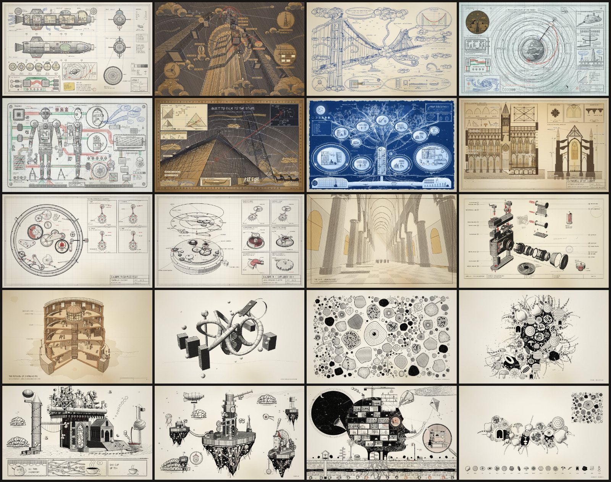

# Doodle with Agents

**Hand-drawn sketches and doodles, drawn stroke by stroke in plain JavaScript. Give this repo to your coding agent
and ask it for a drawing.**



Every line here is code: a pencil stroke with wobble, pressure and overshoot; hatching clipped to a shape;
stipple, watercolour washes, handwriting, cloud ropes, engraved bark, a 3D camera whose shading is done with a pen.
The viewer replays the strokes with a pencil, so each drawing is drawn in front of you. No build step, no
libraries, no images.

## Make a drawing with your agent

Clone the repo, open your coding agent (Claude Code, Codex, Cursor, …) in it, and ask:

> Draw a lighthouse on a rock in a gale, in ink on kraft paper, with a cutaway of the lamp room.

> Make a doodle that grows out of a single eye until the page is full.

> Sketch my bicycle as an exploded technical drawing, blue ballpoint on graph paper.

The agent reads [`AGENTS.md`](AGENTS.md), which teaches it the API, the paper styles and the rules that make a
drawing look hand-made. It then writes `scenes/<name>.js` and renders it to see what it drew, fixing the drawing
until it is right. Claude Code also gets the `doodle` skill in `.claude/skills/`.

Setup:

```sh
npm install
npx playwright install chromium      # the agent renders with this to see its drawing
```

## Look at the drawings

Open `index.html` in a browser (or `npm run serve`). It is a spiral sketchbook: flip through the plates and press
**D** to watch one drawn from a blank page. You can change the speed (1–5), pause (P) or finish the drawing
(Space). `sheet.html?scene=house` opens a single drawing.

```sh
node tools/render.mjs house                    # renders/house.png
node tools/render.mjs house --stages 4         # the drawing at four stages of the pen
node tools/render.mjs house --video            # renders/house.mp4, the pen drawing it (needs ffmpeg)
node tools/gallery.mjs                         # every plate → docs/images/
```

## What is in it

| | |
|---|---|
| `src/engine.js` | The 2D engine. Lines, curves, ellipses, hatching and cross-hatching, stipple and washes. Also a built-in single-stroke alphabet, notes with leader lines, dimension lines, cumulus clouds, cloud ropes, leaves, engraved strands and circuit traces. |
| `src/engine3d.js` | A perspective camera with solids (extrusions, cylinders, gears, lathe shapes). Hidden faces are removed, and each face is shaded by pen hatching that follows the light, in a dozen styles (engraving, stipple, contour, spot black, wash and more). |
| `src/doodle.js` | The doodle kit. 20 motifs and 12 pattern fills, growth by packing or by budding, tendrils, tentacles and spires, and the shading moves that make black-and-white ink read as volume. |
| `src/kit.js` | A toolbox of noise, colour, Voronoi and jigsaw cells, Poisson packing, contour lines and watercolour with blooms and granulation. |
| `scenes/` | 20 drawings to learn from, plus two starter templates. |

The plates: *Spaceship · Burj Khalifa · Bridge · Space Elevator · Mechanical Robot · Pyramids · Library Tree ·
Cathedral · Watch Movement (plan and 3D) · Nave · Camera (exploded) · Rotunda · Doodle · Automatic Doodle · Ink
Garden · Tea Engine · Clock Island · The House That Draws Itself · Doodle Kit*.

## Publishing the sketchbook

It is a static site. GitHub Pages, Vercel or any file host can serve the repo root as it is.

## Licence

MIT — see [LICENSE](LICENSE). Drawings you make with it are yours.
